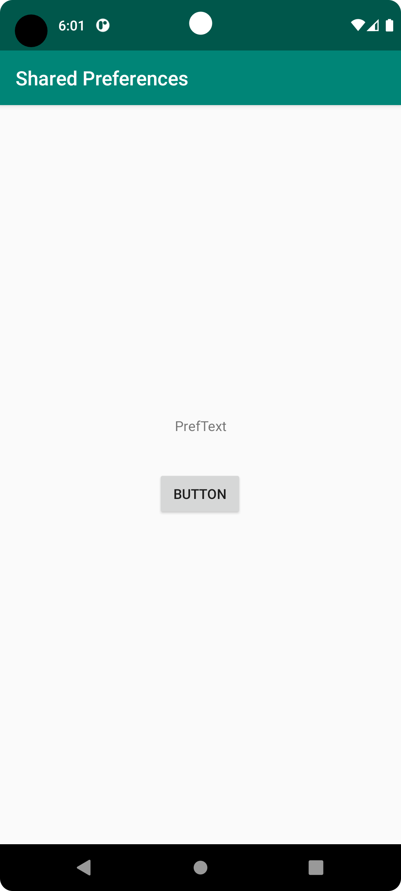
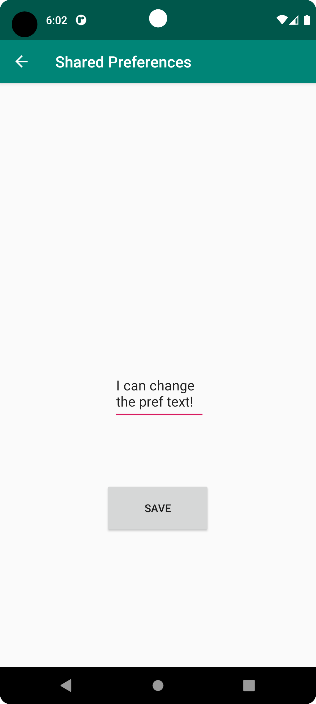

# Rapport

Forked the app preferences from lenasys and cloned the project from my own github.
I created a SecondActivity where the edittext for the pref is located.
I created a button in MainActivity with Intent to SecondActivity, when clicked the Second starts.
In SecondActivity I created a Save-button which stores the PrefText.
Made the MainActivity parent to SecondActivity for ease to go back.


Below shows the code for what actions saveButton does in SecondActivity. It applies the changes you edited
the pref text to.
```
       saveButton.setOnClickListener(new View.OnClickListener() {
            @Override
            public void onClick(View view) {
                String text = prefText.getText().toString();
                myPreferenceEditor.putString("MyPreferenceName", text);
                myPreferenceEditor.apply();
            }
        });
```

After applying the changes. 
When going back to MainActivity, the pref text is updated from what was saved.

```
  protected void onResume() {
        super.onResume();
        SharedPreferences sharedPreferences = getSharedPreferences("MyPreferenceName", Context.MODE_PRIVATE);
        String text = sharedPreferences.getString("MyPreferenceName","Saved text");
        textView.setText(text);
    }
```


The Screen of mainActivity



When pressed the button, SecondActivity appears
Here you can edit and save the preftext.



Back on the mainActivity the new text is set and saved.


Läs gärna:

- Boulos, M.N.K., Warren, J., Gong, J. & Yue, P. (2010) Web GIS in practice VIII: HTML5 and the canvas element for interactive online mapping. International journal of health geographics 9, 14. Shin, Y. &
- Wunsche, B.C. (2013) A smartphone-based golf simulation exercise game for supporting arthritis patients. 2013 28th International Conference of Image and Vision Computing New Zealand (IVCNZ), IEEE, pp. 459–464.
- Wohlin, C., Runeson, P., Höst, M., Ohlsson, M.C., Regnell, B., Wesslén, A. (2012) Experimentation in Software Engineering, Berlin, Heidelberg: Springer Berlin Heidelberg.
